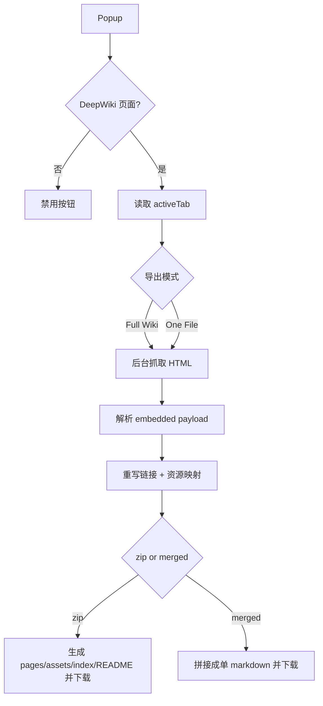

# DeepWiki Downloader

Chrome Manifest V3 扩展：在 DeepWiki 项目页中一键导出文档。

## 功能
- `Full Wiki`：下载 ZIP 包（所有页面 + 图片资源）
- `One File`：下载合并 Markdown（单文件）
- 自动重写内链，便于离线阅读
- 导出过程显示实时状态

## 快速开始

```bash
pnpm install
pnpm run build
pnpm run test
```

## 安装

1. 打开 `chrome://extensions`
2. 开启「开发者模式」
3. 点击「加载已解压的扩展程序」
4. 选择仓库里的 `dist/`

打开任一 `https://deepwiki.com/<org>/<repo>` 页面，点击扩展图标进行导出。

## 核心架构



## 项目结构

- `src/popup/*`：弹窗页面与交互
- `src/background/*`：后台编排、状态、下载
- `src/core/*`：URL 解析、payload 解析、链接/资源处理、ZIP 组装
- `src/shared/*`：消息协议与类型定义
- `tests/*`：单测与集成测试

## 输出示例

- ZIP：`<org>-<repo>-deepwiki.zip`
  - `pages/*.md`
  - `assets/*`
  - `README.md`
  - `index.json`
- 合并：`<org>-<repo>-deepwiki.md`

## 发布与下载

- 当前版本：`0.1.1`
- Release 链接：`https://github.com/char1iez/deepwiki-download/releases`

## 限制

- 仅支持 DeepWiki 项目页面
- 图片以外的外链资源可能不完整下载
- 非核心资源下载失败不会中断导出，写入 warning

## Star History

[](https://star-history.com/#char1iez/deepwiki-download&Date)
